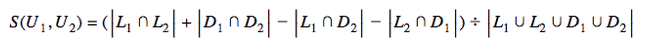

# Recommendation-engines

Task: map (user,item) pair into {likes,dislikes}

Training data: known likes/dislikes

Test data: active users

## Collaborative Filtering

This approach uses the collective intelligence and behaviour of the entire user base to generate recommendations and is content agnostic. The algorithm would look at users who's behaviour and interests resemble the query user and base recommendations on this data.  e.g. "people who viewed/liked/bought this item also viewed/liked/bought this other item"

A matrix representation can be used with users on one dimension and items on the other. Each cell contains a binary entry: 1 = item liked 0 = item disliked. If the user hasn't seen the item the cell would be left empty so for a large user and item space the matrix is likely to be very sparse.

A user can be extracted a vector. Similarity indices can be calculated between a query user and every other user. The algorithm could then pick the top K most similar users and get recommendations out of their rated/liked items.

### Similarity indices

A similarity index is a way of gauging how alike two users are.

#### Cosine similarity

Look at the dot product between a query user's vector and each other user.

#### Jaccard coefficients

Look at the Jaccard coefficient between the query user and each other user. The Jaccard coefficient is useful for measuring binary data (swiped left/right or liked/disliked) and gives a value between 0 and 1.

Where A n B represents the common items liked by **both** User A and User B, and A u B represents the total number of items liked by Users A and B (so all the items they have liked/disliked).

The Jaccard index of two identical Users will always be 1, while the Jaccard index of two Users with no common likes will always yield 0.  

The equation could also be modified to separate likes and dislikes to calculate a coefficient between -1 and 1 where two users with a coefficient of -1 have completely opposite tastes.

#### K-nearest neighbours

For 1000s of users, comparing a query user with every other user could take a long time. Instead only the K nearest neighbours could be used. The Jaccard Coefficients can be used to create a sorted set in order of most similarity. The top K users can then be extracted and used to generate the recommendations.

Alternatively if using cosine similarity, the weighted sum of the top K user profiles could be calculated and considered as the query user's predicted profile e.g perform the weighted sum using normalized cosine similarities as weights (so the weights are between 0 and 1).

## Content Based Filtering

Recommendations are based on the characteristics of the items e.g. books/movies. The algorithm matches these to the characteristics of items previously liked/disliked by a user. Only the given user's choices are reflected in the recommendations.  

## Hybrid Systems

Each approach has its limitations:

***Content based***:
* Generating a useful description of the content can be very difficult.
* Algorithm will not select items if the previous user behavior does not provide evidence for this - . system doesn't provide recommendations outside the scope of what the user has already shown interest in.

***Collaborative Filtering***:
* Early rater problem - cannot provide recommendations for new items since there are no user ratings on which to base a prediction. Even if users start rating the item it will take some time before the item has received enough ratings.  New users who have rated few items will get innacurate recommendations.
* Need groups of users with overlapping characteristics - individuals who don't fit into with any group will receive inaccurate recommendations.

These two approaches work together and a hybrid solution is often best as it uses metadata about the actual items and also data about the collective user group e.g. recommending movies based on both other users’ activities and the movies’ attributes.

## Libraries

Npm modules:

* [recommendationRaccoon](https://github.com/guymorita/recommendationRaccoon) - build on top of Node.js and Redis. Uses Jaccard coefficients and K-nearest neighbours algorithm for recommendations.

# Further Reading

* [Tutorial of a basic implementation of Collaborative Filtering using Jaccard Coefficients (written with coffescript and express)](http://www.toptal.com/algorithms/predicting-likes-inside-a-simple-recommendation-engine)

* [Explanation of similarity indices used in Collaborative Filtering](http://functionspace.com/articles/63/Collaborative-Filtering--A-Recommender-System-)
